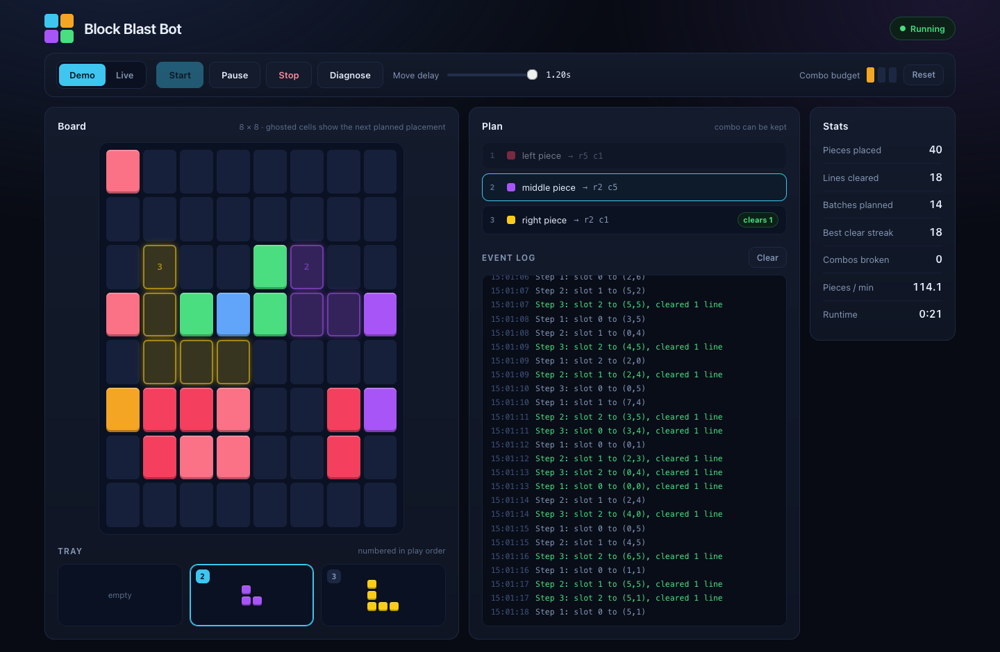
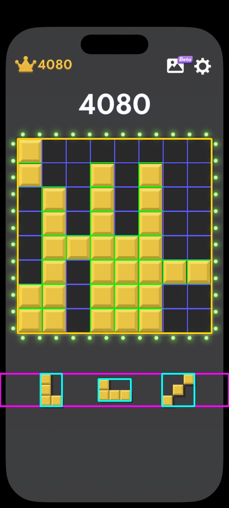

# Block Blast Bot

Plays Block Blast on your iPhone through macOS iPhone Mirroring. It takes screenshots of the mirrored screen, works out the board and the three pieces, plans where to put them and drags them into place with the mouse.



## Setup

```bash
pip install -r requirements.txt
python main.py
```

This opens the dashboard in your browser at `http://127.0.0.1:8765`. If that port is taken it uses the next free one and prints the address in the terminal.

## Demo mode

Pick **Demo** and press **Start**. The bot plays a simulated game in the browser, so you don't need a phone for this. Use the move delay slider to speed it up or slow it down.

## Playing the real game

1. Open iPhone Mirroring on your Mac and start Block Blast on the phone.
2. In System Settings, under Privacy & Security, give the terminal you run the bot from Screen Recording and Accessibility permission. Restart the terminal afterwards.
3. Run `python main.py`, pick **Live** and press **Start**.

The first time the bot sees a piece shape, a window pops up with a screenshot of the piece being held. Click the center of the red highlighted cell. This only happens once per shape, and the result is saved in `piece_calibration.json`.

I know that having to click the pieces yourself isn't the most elegant solution, but it was necessary. I couldn't get automatic detection of where a held piece ends up to be 100% accurate, and a slightly wrong position means the piece gets dropped in the wrong place.

Press **Escape** at any time to pause or resume, even while iPhone Mirroring is focused. The dashboard also has Pause and Stop buttons.

### Tip: use a solid color tile image

Block Blast lets you set a custom tile image for the blocks. Setting it to a plain solid color makes the blocks much easier for the bot to tell apart from the background, so it misreads the board less often. Patterned or photo tiles can confuse it.

## How it works

1. **Capture.** `capture.py` screenshots the iPhone Mirroring window. It still works if other windows are covering it.
2. **Read the board.** `read_state.py` finds the board by looking for a large dark square, then checks the middle of each of the 64 cells to see if a block is there. The three tray pieces are read from the area below the board.
3. **Plan.** `solver.py` tries every order and position for the three pieces. It prefers moves that place every piece, keep the combo going, leave plenty of open space and set up lines that are close to clearing.
4. **Place.** `drag_controller.py` drags each piece to its spot. Before letting go it checks that the right cells are covered, and if they aren't it puts the piece back. After each move the bot checks the board matches what it expected.

The bot stops when a piece can't be placed anywhere, since that means the game is over.



The board is outlined in gold, filled cells in green, the tray area in magenta and each piece in cyan.

## If it isn't reading the board properly

Press **Diagnose** in the dashboard with the game open. It takes one screenshot, logs what it found and saves `diagnose_frame.png` and `diagnose_annotated.png` so you can see what was detected. The full report is at `http://127.0.0.1:8765/api/diagnose`.

Things to try:

- Set the tile image to a solid color (see above).
- Make sure iPhone Mirroring is on the Block Blast game screen and not a menu.

`python test_vision.py` runs the board reading against drawn test frames if you want to check the vision code after changing it.

## Files

| File | What it does |
|---|---|
| `main.py` | Starts the dashboard |
| `dashboard/` | Web server and page |
| `bot_runner.py` | Starts and stops runs for the dashboard |
| `auto_play.py` | Live play loop |
| `demo_play.py`, `simulator.py` | Demo mode |
| `capture.py` | Screenshots the iPhone Mirroring window |
| `read_state.py` | Reads the board and tray |
| `solver.py` | Plans moves |
| `drag_controller.py`, `input_sim.py` | Mouse drags |
| `piece_calibration.py` | Records pickup points for new shapes |
| `hotkey.py`, `pause_control.py` | Escape key and pause/stop |
| `telemetry.py` | State shared with the dashboard |
| `diagnose.py` | The Diagnose button |
| `test_vision.py` | Vision tests |

Live play only works on macOS. Demo mode runs anywhere.
